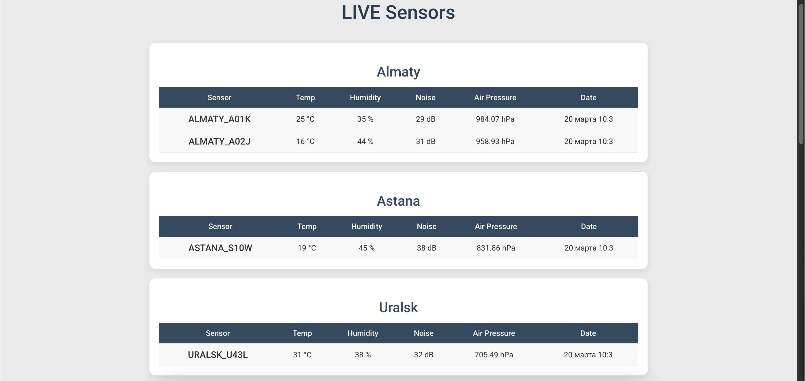
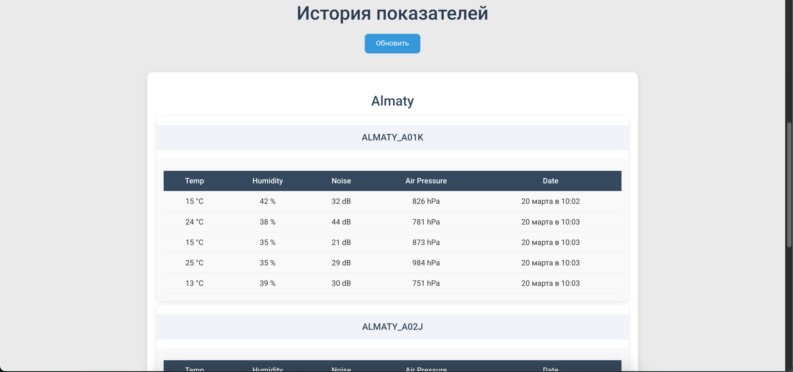

# Air Quality Monitoring (random)

📌 Описание проекта

Этот проект представляет собой систему мониторинга качества воздуха. Данные с сенсоров генерируются случайным образом каждые 5 секунд (можно настроить) для имитации работы реального сенсора. Затем данные проходят через RabbitMQ, сохраняются в PostgreSQL и обновляются в реальном времени через WebSocket на сайте.

Также есть возможность просматривать прошлые данные.

🚀 Запуск проекта

1. Клонирование репозитория
2. Запуск с помощью Docker Compose
3. Убедитесь, что у вас установлен Docker и Docker Compose. Проект автоматически поднимет все необходимые сервисы: PostgreSQL, RabbitMQ и сам сервис мониторинга.
4. После запуска сервис будет доступен по адресу: http://localhost:7777/

🛠️ Используемые технологии: 
- Java 21
- Spring Boot
- PostgreSQL (17)
- RabbitMQ
- WebSocket
- Docker
- Mockito / JUnit
- MapStruct
- Flyway

📊 Функционал

Генерация случайных данных качества воздуха каждые 5 секунд
Передача данных через RabbitMQ
Сохранение данных в PostgreSQL
Обновление данных на фронтенде в реальном времени через WebSocket
Просмотр исторических данных

Готово!🚀
